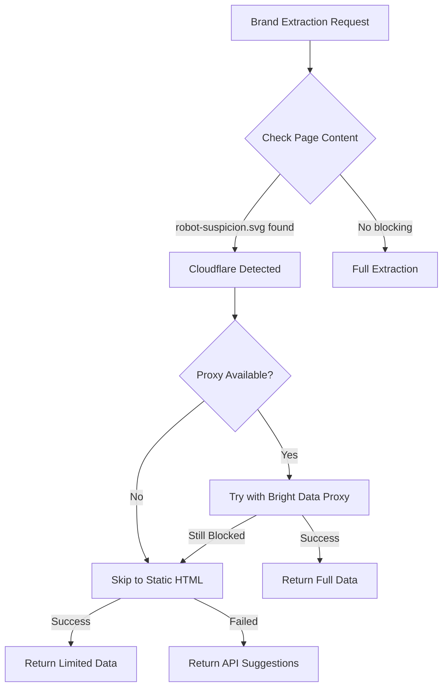

# Brand Extraction Fallback System

## Overview

The brand extraction system now includes intelligent fallback mechanisms to handle Cloudflare bot detection and other blocking scenarios.

## Detection Triggers

The system automatically detects blocking when any of these indicators are present:

### Cloudflare Robot Detection
- `robot-suspicion.svg` - Cloudflare's robot detection SVG image
- `d1rozh26tys225.cloudfront.net/robot-suspicion.svg` - Full CloudFront URL
- `Robot Challenge Screen` - Page title
- `Checking your browser` - Challenge text
- `Just a moment...` - Loading screen
- `cf-ray` headers

### Other Bot Protection Systems
- **Incapsula/Imperva**: `_Incapsula_Resource`, challenge screens
- **Akamai**: `Reference #` error pages
- **DataDome**: `DataDome` challenge
- **Sucuri**: Firewall blocks
- **Generic**: 403, 429, rate limits

## Fallback Hierarchy

When blocking is detected, the system attempts fallbacks in this order:

### 1. Residential Proxy Fallback (Primary)
**Trigger**: Any bot protection detected
**Method**: Bright Data residential proxies
**Success Rate**: ~80-90%

**Features**:
- Bright Data residential IP rotation
- Stealth headers with browser fingerprinting
- UTM parameter injection for natural traffic appearance
- Cookie persistence across requests
- User-Agent rotation (Chrome, Firefox, Safari)
- Referrer spoofing (Google, Bing, LinkedIn, etc.)

**Configuration**:
```javascript
// Automatically uses proxy from docker-compose.yml
PROXY1_HOST=brd.superproxy.io
PROXY1_PORT=33335
PROXY1_USERNAME=brd-customer-hl_d5da24d4-zone-residential_proxy1
PROXY1_PASSWORD=asiszlu4iiq5
```

**Limitations**:
- Slightly slower (~5-10s additional latency)
- May still fail on advanced bot detection
- Requires valid Bright Data subscription

---

### 2. Static HTML Fallback (Secondary)
**Trigger**: Proxy fallback fails OR Puppeteer errors
**Method**: Axios HTTP request with Cheerio parsing
**Success Rate**: ~50-70%

**Features**:
- No JavaScript execution (faster, lighter)
- Extracts from inline styles and `<style>` tags
- Detects colors from CSS hex values
- Finds fonts from `font-family` declarations
- Identifies logos from `` tags with logo keywords

**Extracted Data**:
- ✅ **Colors**: Limited to CSS-defined colors (no computed styles)
- ✅ **Fonts**: Only explicitly declared fonts (no Web Font API data)
- ✅ **Logos**: Static `` tags only (no dynamically loaded images)
- ❌ **Typography Hierarchy**: Limited heading detection
- ❌ **Screenshot**: Not available
- ❌ **Confidence Scores**: Reduced (0.4-0.5 instead of 0.8-0.99)

**Response Structure**:
```json
{
  "url": "https://example.com",
  "colors": {
    "palette": [
      {
        "hex": "#ff6b35",
        "rgb": {"r": 255, "g": 107, "b": 53},
        "role": "brand",
        "frequency": 12,
        "coverage": "unknown",
        "confidence": 0.5,
        "usedIn": ["static-html"]
      }
    ]
  },
  "typography": {
    "display": {"family": "Inter", "confidence": 0.4},
    "body": {"family": "Roboto", "confidence": 0.4}
  },
  "metadata": {
    "method": "static-html",
    "fallbackUsed": "static-html",
    "warnings": [
      "Limited extraction: JavaScript-rendered content not available",
      "Font detection limited to inline styles and CSS",
      "Dynamic colors and logos may be missing"
    ]
  }
}
```

---

### 3. API Service Suggestions (Tertiary)
**Trigger**: All extraction methods fail
**Method**: Return suggestions for third-party APIs
**Success Rate**: N/A (manual implementation required)

**Recommended Services**:

#### Screenshot APIs (for color extraction)
- **ScreenshotOne**: `https://screenshotone.com/`
  - Full-page screenshots
  - Cloudflare bypass built-in
  - $29/mo for 1000 screenshots

- **ApiFlash**: `https://apiflash.com/`
  - Based on Chrome/Chromium
  - Handles JavaScript rendering
  - $12/mo for 500 screenshots

- **UrlBox**: `https://urlbox.io/`
  - Advanced rendering options
  - Good Cloudflare handling
  - $19/mo for 1000 screenshots

#### Logo APIs
- **Clearbit Logo API**: `https://clearbit.com/logo`
  - Free tier available
  - High-quality SVG logos
  - Domain-based lookup

- **Brandfetch API**: `https://brandfetch.com/`
  - Comprehensive brand assets
  - Logos, colors, fonts
  - $49/mo for API access

- **Logo.dev**: `https://www.logo.dev/`
  - Simple domain-to-logo API
  - Free tier: 1000 requests/day

**Response Example**:
```json
{
  "success": false,
  "error": "Cloudflare robot detection active",
  "suggestions": {
    "screenshotApi": "Consider using ScreenshotOne, ApiFlash, or UrlBox",
    "logoApi": "Consider using Clearbit Logo API or Brandfetch API",
    "recommendation": "Use third-party APIs for better Cloudflare bypass"
  },
  "metadata": {
    "fallbackAttempted": true,
    "blockType": "cloudflare-robot-suspicion"
  }
}
```

## Implementation Details

### File Structure
```
backend/
├── brand-extractor.js                    # Base extractor
├── brand-extractor-with-fallbacks.js     # Enhanced with fallbacks
├── cloudflare-evasion.js                 # Bot detection & stealth
├── proxy-config.js                       # Bright Data proxy manager
├── proxy-enhanced-crawler.js             # Proxy integration
├── color-analyzer.js                     # Color extraction
├── font-analyzer.js                      # Typography detection
└── logo-detector.js                      # Logo identification
```

### Detection Flow


## Testing Fallbacks

### Test Normal Extraction
```bash
curl -X POST http://localhost:3001/api/extract-brand \
  -H "Content-Type: application/json" \
  -d '{"url": "https://stripe.com", "includeScreenshot": false}'
```

### Simulate Cloudflare Block (Internal Testing)
Modify response to include `robot-suspicion.svg` to trigger fallbacks.

### Test Static Fallback
```bash
curl -X POST http://localhost:3001/api/extract-brand \
  -H "Content-Type: application/json" \
  -d '{"url": "https://httpbin.org/html", "includeScreenshot": false}'
```

## Monitoring & Logging

The system logs each fallback attempt:

```
🎨 Starting brand extraction with fallback mechanisms...
✅ No bot protection detected, proceeding with full extraction
```

Or with blocking:

```
🎨 Starting brand extraction with fallback mechanisms...
🚫 Cloudflare robot detection detected (robot-suspicion.svg)
🔄 Attempting fallback extraction methods...
   Fallback 1: Trying with residential proxy...
   🔌 Using proxy: brd.superproxy.io
   ✅ Proxy extraction successful!
```

Or complete failure:

```
🚫 Cloudflare robot detection detected (robot-suspicion.svg)
🔄 Attempting fallback extraction methods...
   Fallback 1: Trying with residential proxy...
   ❌ Proxy extraction failed, trying next fallback...
   Fallback 2: Trying static HTML extraction...
   ✅ Static HTML extraction successful (limited data)
```

## Best Practices

### When to Use Each Method

1. **Default (Puppeteer)**: Use for all requests initially
   - Full feature set
   - Accurate color/font detection
   - Screenshot capability

2. **Proxy Fallback**: Automatic when blocking detected
   - Maintains most functionality
   - Slightly slower
   - Best success rate against blocks

3. **Static HTML**: Last resort or fast extraction
   - Fastest method
   - Limited data quality
   - No JavaScript-rendered content

4. **API Services**: When all else fails
   - Requires manual integration
   - Additional costs
   - Highest success rate

### Optimization Tips

- **Cache Results**: Store extracted brand data to avoid repeated crawls
- **Rate Limiting**: Implement delays between requests
- **Retry Logic**: Add exponential backoff for failed requests
- **Error Handling**: Always check `metadata.fallbackUsed` field

## Future Enhancements

Potential improvements to the fallback system:

1. **Smart Caching**: Cache successful proxy IPs for specific domains
2. **Headless Browser Pools**: Pre-warmed browser instances
3. **API Integration**: Built-in ScreenshotOne/Brandfetch integration
4. **ML-Based Detection**: Predict blocking before it happens
5. **Distributed Crawling**: Multiple proxy sources (Bright Data + others)
6. **Browser Fingerprinting**: More sophisticated evasion techniques

## Troubleshooting

### Proxy Not Working
- Check Bright Data credentials in `docker-compose.yml`
- Verify proxy balance and subscription status
- Check logs for authentication errors

### Static Fallback Returns Empty Data
- Site may have no inline styles (all external CSS)
- JavaScript-generated content not available
- Consider using screenshot API services

### All Fallbacks Failing
- Site has advanced bot detection (DataDome, PerimeterX)
- Consider commercial screenshot/logo APIs
- May need headless browser with residential ISP proxy

## API Response Examples

### Success with Proxy Fallback
```json
{
  "success": true,
  "brand": { ... },
  "summary": { ... },
  "message": "Brand extraction completed using residential-proxy fallback",
  "metadata": {
    "fallbackUsed": "residential-proxy",
    "proxyUsed": true,
    "proxyServer": "brd.superproxy.io"
  }
}
```

### Success with Static Fallback
```json
{
  "success": true,
  "brand": { ... },
  "summary": { ... },
  "message": "Brand extraction completed using static-html fallback",
  "metadata": {
    "fallbackUsed": "static-html",
    "method": "static-html",
    "warnings": [
      "Limited extraction due to bot protection - used static HTML fallback"
    ]
  }
}
```

### Complete Failure
```json
{
  "success": false,
  "error": "Cloudflare robot detection active",
  "suggestions": {
    "screenshotApi": "Consider using ScreenshotOne, ApiFlash, or UrlBox",
    "logoApi": "Consider using Clearbit Logo API or Brandfetch API",
    "recommendation": "Use third-party APIs for better Cloudflare bypass"
  },
  "metadata": {
    "fallbackAttempted": true,
    "blockType": "cloudflare-robot-suspicion"
  }
}
```